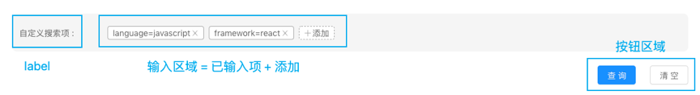
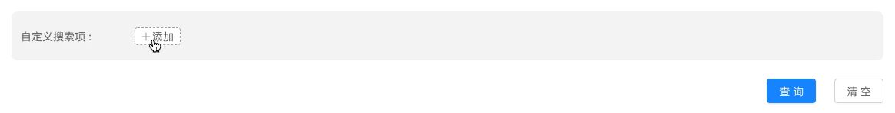
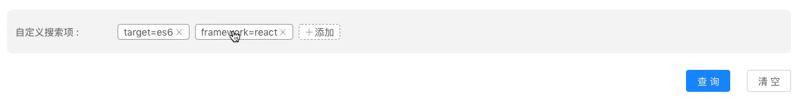

# Demo for Key-Value editor

这个项目来源于一道所谓的面试题。 [Demo Page]().

原题

>
> ## 使用 React 实现如图所示的组件
>
> 该组件是一个 key-value（以下简称 kv） 搜索项输入组件，可用让用户输入多个 kv对
>
> ### 组件效果展示
>
> #### 布局展示
>
> 
>
> #### 输入（gif 示意）
>
> 可以输入新值，删除已有值
>
> 
>
> 可以编辑已输入的值
>
> 
>
> #### 输出
>
> 点击查询时，控制台打印输入的结果，比如:
>
> ```
> {
>   target: "es6",
>   framework: "react",
> }
> ```
>
> #### 功能点
>
> 1. 新输入 kv 对
> 2. 编辑已输入的 kv 对
> 3. 删除已存在的 kv 对
> 4. 点击查询按钮，log 输入值
> 5. 点击清空按钮，清除所有输入
> 6. 输入校验
>
> ### 编码限制
>
> 1. 必须使用 React 框架
>
> 2. 不使用除 antd 之外的组件库
>
> 3. 有借鉴、引用的代码需要注明出处（不推荐引用他人代码）
>
> 4. 单文件代码行数不大于 300
>
> ### 补充说明
>
> 1. 组件样式 **不做严格要求**，大致符合即可
> 2. 提交的时候需要连带完整的项目脚手架一起提交（可使用 cra、umi 等）
> 3. 提交的工程附带 README.md，里面写你觉得需要补充说明的内容
>
> ### 加分项
>
> 1. 注释充分
> 2. 使用 React hooks
> 3. 使用 Typescript
>